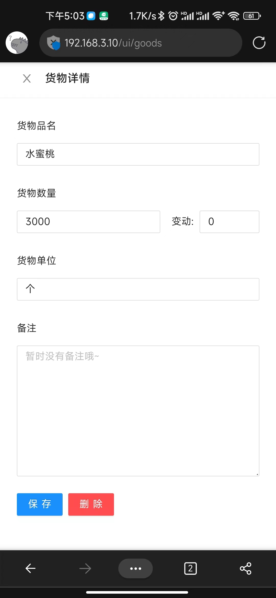
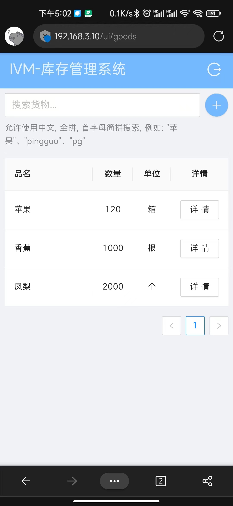

# simple-ivm
 一个纯粹的库存管理系统




# HOW-TO-INSTALL
## By Docker
```sh
docker pull mjay1069/simple-ivm
docker run -p 80:80 -e IVM_PASSWORD=666777 -e IVM_USERNAME=admin mjay1069/simple-ivm
```

## Support Envs(default)
- IVM_DB_URI =  "sqlite:///data.db"
- IVM_SECRET_KEY = "asdfjiaoksdfiwmsdfjm"
- IVM_ALGORITHM = "HS256"
- IVM_USERNAME = "admin"
- IVM_PASSWORD = "998877"